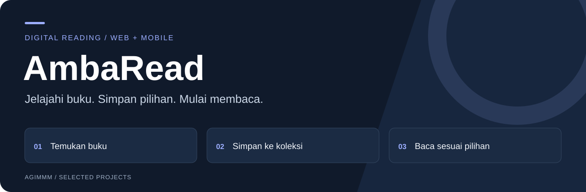
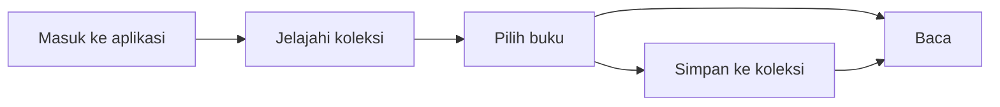

# AmbaRead — Pengalaman Membaca di Web dan Mobile

AmbaRead merupakan paket aplikasi membaca buku dengan implementasi web berbasis PHP dan aplikasi mobile berbasis Flutter. Halaman ini menjadi pintu masuk untuk memahami produknya dan menemukan repositori terkait.

**Web: PHP & MySQL · Mobile: Flutter & Dart**

[Alur pembaca](#alur-pembaca) · [Fitur](#cakupan-produk) · [Repo mobile](#repositori-dalam-paket-ambaread) · [Panduan teknis](docs/SETUP.md)

## Kebutuhan yang dilayani

Pembaca membutuhkan cara untuk menemukan buku, menyimpan pilihan, dan membuka bacaan. Pengelola membutuhkan halaman untuk mengatur koleksi buku. AmbaRead mencakup kedua sisi tersebut dalam versi web, serta pengalaman membaca melalui aplikasi mobile.

## Alur pembaca

## Cakupan produk

| Web | Mobile |
| --- | --- |
| Akun dan profil pembaca | Halaman masuk, daftar, dan profil |
| Katalog serta pencarian buku | Beranda dan penelusuran genre |
| Halaman membaca isi buku | Halaman detail dan pembaca buku |
| Koleksi buku favorit | Koleksi buku tersimpan |
| Halaman pengelolaan buku | State aplikasi menggunakan Provider |

Web dan mobile disajikan sebagai bagian dari satu produk. Tabel ini merangkum cakupan masing-masing; tidak menyatakan bahwa seluruh data tersinkronisasi antaraplikasi.

## Repositori dalam paket AmbaRead

| Repositori | Isi |
| --- | --- |
| **[ambaread](https://github.com/Agimmm/ambaread)** | Implementasi web dan ringkasan portofolio produk. |
| **[AmbaMobile](https://github.com/Agimmm/AmbaMobile)** | Pintu masuk dokumentasi aplikasi Flutter. |
| [ambamobilefinal](https://github.com/Agimmm/ambamobilefinal) | Salinan terkait implementasi mobile. |
| [Ambaread_Mobile](https://github.com/Agimmm/Ambaread_Mobile) | Repositori terkait pengembangan mobile. |

## Skenario peninjauan produk

- **Pembaca web:** jelajahi buku, simpan pilihan ke favorit, kemudian buka halaman membaca.
- **Pengelola web:** tinjau alur penambahan dan pengeditan koleksi buku.
- **Pembaca mobile:** buka beranda, pilih genre, tinjau koleksi tersimpan, lalu buka halaman pembaca.

## Peran dan status proyek

**Peran saya: Backend Web Engineer.** Fokus kontribusi saya berada pada sisi backend web. Bagian mobile ditautkan untuk menunjukkan cakupan produk secara keseluruhan, bukan sebagai klaim kontribusi pengembangan mobile saya.

Paket AmbaRead telah selesai dikembangkan dan digunakan. Repositori ini menyajikan implementasi web serta navigasi ke bagian mobile.

## Peta kode web

| Berkas | Fungsi |
| --- | --- |
| [landingpage.php](landingpage.php) | Halaman pengenalan web. |
| [buku.php](buku.php) | Halaman koleksi buku. |
| [baca_buku.php](baca_buku.php) | Menampilkan isi buku yang dipilih. |
| [mybooks.php](mybooks.php) | Koleksi pembaca. |
| [favorite_action.php](favorite_action.php) | Menambahkan atau menghapus buku favorit. |
| [search_suggestions.php](search_suggestions.php) | Saran pencarian. |
| [admin_books_proses.php](admin_books_proses.php) | Pemrosesan pengelolaan buku. |

Informasi konfigurasi ada pada [panduan teknis](docs/SETUP.md).

---

Bagian dari [portofolio Amir Gymnastiar](https://github.com/Agimmm).
